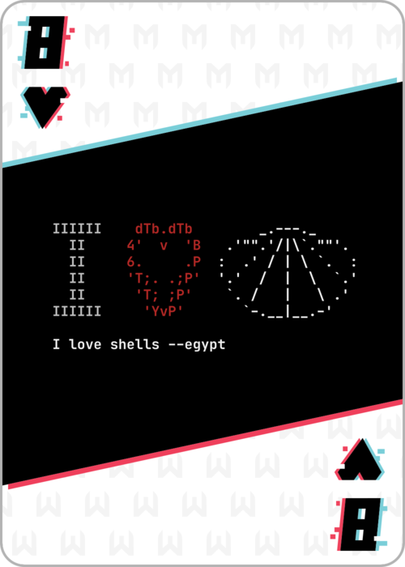

# Metasploit 2020 - 8 of Hearts

The 8 of Hearts challeng eprovided the player with an ELF binary and a file appearing to contain ciphertext.

8_of_hearts.elf
8_of_hearts.enc

First thing's first, we run "file" on the files, as one does.
![8_of_hearts.elf: ELF 64-bit LSB pie executable, x86-64, version 1 (SYSV), dynamically linked, interpreter /lib64/ld-linux-x86-64.so.2, BuildID[sha1]=7d5bfd0b09ae02541c080fa39673f5c0edc19f59, for GNU/Linux 3.2.0, not stripped
8_of_hearts.enc: data](images/8_of_hearts/runningfile.png)

Now, we run "strings".

Okay, we see it does something with 8_of_hearts.enc and 8_of_hearts.png. We also see it likes "buffalo".
Let's just run it and see what happens.

Okay, let's look at it with "objdump" using the "-d" or "--disassemble" flag.
![0000000000001229 <main>:
    1229:       f3 0f 1e fa             endbr64 
    122d:       55                      push   %rbp
    122e:       48 89 e5                mov    %rsp,%rbp
    1231:       48 81 ec 00 08 00 00    sub    $0x800,%rsp
    1238:       c7 45 fc 00 00 00 00    movl   $0x0,-0x4(%rbp)
    123f:       48 8d 85 00 fc ff ff    lea    -0x400(%rbp),%rax
    1246:       ba e8 03 00 00          mov    $0x3e8,%edx
    124b:       be 00 00 00 00          mov    $0x0,%esi
    1250:       48 89 c7                mov    %rax,%rdi
    1253:       e8 a8 fe ff ff          call   1100 <memset@plt>
    1258:       48 8d 85 10 f8 ff ff    lea    -0x7f0(%rbp),%rax
    125f:       ba e8 03 00 00          mov    $0x3e8,%edx
    1264:       be 00 00 00 00          mov    $0x0,%esi
    1269:       48 89 c7                mov    %rax,%rdi
    126c:       e8 8f fe ff ff          call   1100 <memset@plt>
    1271:       48 8b 15 98 2d 00 00    mov    0x2d98(%rip),%rdx        # 4010 <stdin@@GLIBC_2.2.5>
    1278:       48 8d 85 10 f8 ff ff    lea    -0x7f0(%rbp),%rax
    127f:       be d0 07 00 00          mov    $0x7d0,%esi
    1284:       48 89 c7                mov    %rax,%rdi
    1287:       e8 94 fe ff ff          call   1120 <fgets@plt>
    128c:       48 8d 85 10 f8 ff ff    lea    -0x7f0(%rbp),%rax
    1293:       ba 07 00 00 00          mov    $0x7,%edx
    1298:       48 89 c6                mov    %rax,%rsi
    129b:       48 8d 3d 62 0d 00 00    lea    0xd62(%rip),%rdi        # 2004 <_IO_stdin_used+0x4>
    12a2:       e8 19 fe ff ff          call   10c0 <strncmp@plt>
    12a7:       85 c0                   test   %eax,%eax
    12a9:       74 11                   je     12bc <main+0x93>
    12ab:       48 8d 3d 5a 0d 00 00    lea    0xd5a(%rip),%rdi        # 200c <_IO_stdin_used+0xc>
    12b2:       e8 19 fe ff ff          call   10d0 <puts@plt>
    12b7:       e9 ea 00 00 00          jmp    13a6 <main+0x17d>
    12bc:       c7 45 f8 00 00 00 00    movl   $0x0,-0x8(%rbp)
    12c3:       e9 bf 00 00 00          jmp    1387 <main+0x15e>
    12c8:       48 8d 95 00 fc ff ff    lea    -0x400(%rbp),%rdx
    12cf:       8b 45 f8                mov    -0x8(%rbp),%eax
    12d2:       48 98                   cltq   
    12d4:       48 01 d0                add    %rdx,%rax
    12d7:       ba 07 00 00 00          mov    $0x7,%edx
    12dc:       48 89 c6                mov    %rax,%rsi
    12df:       48 8d 3d 1e 0d 00 00    lea    0xd1e(%rip),%rdi        # 2004 <_IO_stdin_used+0x4>
    12e6:       e8 d5 fd ff ff          call   10c0 <strncmp@plt>
    12eb:       85 c0                   test   %eax,%eax
    12ed:       0f 85 90 00 00 00       jne    1383 <main+0x15a>
    12f3:       c7 45 fc 01 00 00 00    movl   $0x1,-0x4(%rbp)
    12fa:       48 8d 35 24 0d 00 00    lea    0xd24(%rip),%rsi        # 2025 <_IO_stdin_used+0x25>
    1301:       48 8d 3d 20 0d 00 00    lea    0xd20(%rip),%rdi        # 2028 <_IO_stdin_used+0x28>
    1308:       e8 23 fe ff ff          call   1130 <fopen@plt>
    130d:       48 89 45 f0             mov    %rax,-0x10(%rbp)
    1311:       48 8d 35 20 0d 00 00    lea    0xd20(%rip),%rsi        # 2038 <_IO_stdin_used+0x38>
    1318:       48 8d 3d 1c 0d 00 00    lea    0xd1c(%rip),%rdi        # 203b <_IO_stdin_used+0x3b>
    131f:       e8 0c fe ff ff          call   1130 <fopen@plt>
    1324:       48 89 45 e8             mov    %rax,-0x18(%rbp)
    1328:       eb 1b                   jmp    1345 <main+0x11c>
    132a:       0f b6 85 0f f8 ff ff    movzbl -0x7f1(%rbp),%eax
    1331:       83 f0 41                xor    $0x41,%eax
    1334:       0f be c0                movsbl %al,%eax
    1337:       48 8b 55 e8             mov    -0x18(%rbp),%rdx
    133b:       48 89 d6                mov    %rdx,%rsi
    133e:       89 c7                   mov    %eax,%edi
    1340:       e8 cb fd ff ff          call   1110 <fputc@plt>
    1345:       48 8b 55 f0             mov    -0x10(%rbp),%rdx
    1349:       48 8d 85 0f f8 ff ff    lea    -0x7f1(%rbp),%rax
    1350:       48 89 d1                mov    %rdx,%rcx
    1353:       ba 01 00 00 00          mov    $0x1,%edx
    1358:       be 01 00 00 00          mov    $0x1,%esi
    135d:       48 89 c7                mov    %rax,%rdi
    1360:       e8 7b fd ff ff          call   10e0 <fread@plt>
    1365:       48 83 f8 01             cmp    $0x1,%rax
    1369:       74 bf                   je     132a <main+0x101>
    136b:       48 8b 45 f0             mov    -0x10(%rbp),%rax
    136f:       48 89 c7                mov    %rax,%rdi
    1372:       e8 79 fd ff ff          call   10f0 <fclose@plt>
    1377:       48 8b 45 e8             mov    -0x18(%rbp),%rax
    137b:       48 89 c7                mov    %rax,%rdi
    137e:       e8 6d fd ff ff          call   10f0 <fclose@plt>
    1383:       83 45 f8 01             addl   $0x1,-0x8(%rbp)
    1387:       81 7d f8 e1 03 00 00    cmpl   $0x3e1,-0x8(%rbp)
    138e:       0f 8e 34 ff ff ff       jle    12c8 <main+0x9f>
    1394:       83 7d fc 00             cmpl   $0x0,-0x4(%rbp)
    1398:       75 0c                   jne    13a6 <main+0x17d>
    139a:       48 8d 3d aa 0c 00 00    lea    0xcaa(%rip),%rdi        # 204b <_IO_stdin_used+0x4b>
    13a1:       e8 2a fd ff ff          call   10d0 <puts@plt>
    13a6:       b8 00 00 00 00          mov    $0x0,%eax
    13ab:       c9                      leave  
    13ac:       c3                      ret    
    13ad:       0f 1f 00                nopl   (%rax)](images/8_of_hearts/runningobjdump.png)

Looking at this disassembly output, even if you can't read assembly, a few things jump out.
First, we have an "fgets", which reads a line from a specified stream, usually stdin (standard input). This is followed by a "strncmp", or a string compare, then a "puts", which writes to a specified stream, usually stdout.
Further down, we have another "strncmp", followed by "fopen"s, or file opens.

Just from that bit of info, we can surmise that the structure of the program is that it reads standard input, checks if input matches a certain string, and if it doesn't match, it writes a line to standard output, then exits. If it does match, it opens two different files and does some work, presumably decrypting 8_of_hearts.enc and writing 8_of_hearts.png.

Loading this into gdb and running it, we see our address space is different, but the layout is the same.
![(gdb) disassemble main
Dump of assembler code for function main:
   0x0000555555555229 <+0>:     endbr64 
   0x000055555555522d <+4>:     push   %rbp
   0x000055555555522e <+5>:     mov    %rsp,%rbp
   0x0000555555555231 <+8>:     sub    $0x800,%rsp
   0x0000555555555238 <+15>:    movl   $0x0,-0x4(%rbp)
   0x000055555555523f <+22>:    lea    -0x400(%rbp),%rax
   0x0000555555555246 <+29>:    mov    $0x3e8,%edx
   0x000055555555524b <+34>:    mov    $0x0,%esi
   0x0000555555555250 <+39>:    mov    %rax,%rdi
   0x0000555555555253 <+42>:    call   0x555555555100 <memset@plt>
   0x0000555555555258 <+47>:    lea    -0x7f0(%rbp),%rax
   0x000055555555525f <+54>:    mov    $0x3e8,%edx
   0x0000555555555264 <+59>:    mov    $0x0,%esi
   0x0000555555555269 <+64>:    mov    %rax,%rdi
   0x000055555555526c <+67>:    call   0x555555555100 <memset@plt>
   0x0000555555555271 <+72>:    mov    0x2d98(%rip),%rdx        # 0x555555558010 <stdin@@GLIBC_2.2.5>
   0x0000555555555278 <+79>:    lea    -0x7f0(%rbp),%rax
   0x000055555555527f <+86>:    mov    $0x7d0,%esi
   0x0000555555555284 <+91>:    mov    %rax,%rdi
   0x0000555555555287 <+94>:    call   0x555555555120 <fgets@plt>
   0x000055555555528c <+99>:    lea    -0x7f0(%rbp),%rax
   0x0000555555555293 <+106>:   mov    $0x7,%edx
   0x0000555555555298 <+111>:   mov    %rax,%rsi
   0x000055555555529b <+114>:   lea    0xd62(%rip),%rdi        # 0x555555556004
   0x00005555555552a2 <+121>:   call   0x5555555550c0 <strncmp@plt>
   0x00005555555552a7 <+126>:   test   %eax,%eax
   0x00005555555552a9 <+128>:   je     0x5555555552bc <main+147>
   0x00005555555552ab <+130>:   lea    0xd5a(%rip),%rdi        # 0x55555555600c
   0x00005555555552b2 <+137>:   call   0x5555555550d0 <puts@plt>
   0x00005555555552b7 <+142>:   jmp    0x5555555553a6 <main+381>
   0x00005555555552bc <+147>:   movl   $0x0,-0x8(%rbp)
   0x00005555555552c3 <+154>:   jmp    0x555555555387 <main+350>
   0x00005555555552c8 <+159>:   lea    -0x400(%rbp),%rdx
   0x00005555555552cf <+166>:   mov    -0x8(%rbp),%eax
   0x00005555555552d2 <+169>:   cltq   
   0x00005555555552d4 <+171>:   add    %rdx,%rax
   0x00005555555552d7 <+174>:   mov    $0x7,%edx
   0x00005555555552dc <+179>:   mov    %rax,%rsi
   0x00005555555552df <+182>:   lea    0xd1e(%rip),%rdi        # 0x555555556004
   0x00005555555552e6 <+189>:   call   0x5555555550c0 <strncmp@plt>
   0x00005555555552eb <+194>:   test   %eax,%eax
   0x00005555555552ed <+196>:   jne    0x555555555383 <main+346>
   0x00005555555552f3 <+202>:   movl   $0x1,-0x4(%rbp)
   0x00005555555552fa <+209>:   lea    0xd24(%rip),%rsi        # 0x555555556025
   0x0000555555555301 <+216>:   lea    0xd20(%rip),%rdi        # 0x555555556028
   0x0000555555555308 <+223>:   call   0x555555555130 <fopen@plt>
   0x000055555555530d <+228>:   mov    %rax,-0x10(%rbp)
   0x0000555555555311 <+232>:   lea    0xd20(%rip),%rsi        # 0x555555556038
   0x0000555555555318 <+239>:   lea    0xd1c(%rip),%rdi        # 0x55555555603b
   0x000055555555531f <+246>:   call   0x555555555130 <fopen@plt>
   0x0000555555555324 <+251>:   mov    %rax,-0x18(%rbp)
   0x0000555555555328 <+255>:   jmp    0x555555555345 <main+284>
   0x000055555555532a <+257>:   movzbl -0x7f1(%rbp),%eax
   0x0000555555555331 <+264>:   xor    $0x41,%eax
   0x0000555555555334 <+267>:   movsbl %al,%eax
   0x0000555555555337 <+270>:   mov    -0x18(%rbp),%rdx
   0x000055555555533b <+274>:   mov    %rdx,%rsi
   0x000055555555533e <+277>:   mov    %eax,%edi
   0x0000555555555340 <+279>:   call   0x555555555110 <fputc@plt>
   0x0000555555555345 <+284>:   mov    -0x10(%rbp),%rdx
   0x0000555555555349 <+288>:   lea    -0x7f1(%rbp),%rax
   0x0000555555555350 <+295>:   mov    %rdx,%rcx
   0x0000555555555353 <+298>:   mov    $0x1,%edx
   0x0000555555555358 <+303>:   mov    $0x1,%esi
   0x000055555555535d <+308>:   mov    %rax,%rdi
   0x0000555555555360 <+311>:   call   0x5555555550e0 <fread@plt>
   0x0000555555555365 <+316>:   cmp    $0x1,%rax
   0x0000555555555369 <+320>:   je     0x55555555532a <main+257>
   0x000055555555536b <+322>:   mov    -0x10(%rbp),%rax
   0x000055555555536f <+326>:   mov    %rax,%rdi
   0x0000555555555372 <+329>:   call   0x5555555550f0 <fclose@plt>
   0x0000555555555377 <+334>:   mov    -0x18(%rbp),%rax
   0x000055555555537b <+338>:   mov    %rax,%rdi
   0x000055555555537e <+341>:   call   0x5555555550f0 <fclose@plt>
   0x0000555555555383 <+346>:   addl   $0x1,-0x8(%rbp)
   0x0000555555555387 <+350>:   cmpl   $0x3e1,-0x8(%rbp)
   0x000055555555538e <+357>:   jle    0x5555555552c8 <main+159>
   0x0000555555555394 <+363>:   cmpl   $0x0,-0x4(%rbp)
   0x0000555555555398 <+367>:   jne    0x5555555553a6 <main+381>
   0x000055555555539a <+369>:   lea    0xcaa(%rip),%rdi        # 0x55555555604b
   0x00005555555553a1 <+376>:   call   0x5555555550d0 <puts@plt>
   0x00005555555553a6 <+381>:   mov    $0x0,%eax
   0x00005555555553ab <+386>:   leave  
   0x00005555555553ac <+387>:   ret    
End of assembler dump.
(gdb)](images/8_of_hearts/runninggdbdisassemble.png)

From here, we can set a breakpoint at the fgets call.

Now we can run the program again, and catch it at the breakpoint.

Finally, we jump all the way over both "strncmp"s to right after the second one's "jne" (jump not equal) instruction.
![(gdb) jump *0x00005555555552f3
Continuing at 0x5555555552f3.
\[Inferior 1 (process 82421) exited normally\]
(gdb)](images/8_of_hearts/rungdbjump.png)

Great! it exited cleanly. Now we can run "ls" and see that it did create "8_of_hearts.png".

