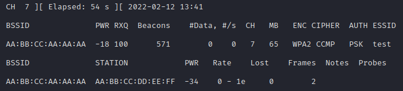

# Cracking Wifi Networks With Aircrack-ng

In this tutorial, I'll take you through attacking a Wifi network using Aircrack-ng by way of a deauthentication attack.


First thing's first, we need to stop some things that like to hog the wireless interfaces.


Next, we need to be able to list available wifi networks for us to attack. In most GUI's this is trivial, but we'll do it from the command line using 'iwlist'.


Now that we know which network we'd like to attack, we need to put our interface into promiscuous mode using airmon-ng. This is basically the same as running ```ip link set wlan0 promisc; ip link set wlan0 up```.


Now, let's start listening.




The flags here, -w specifies which prefix to use when writing your files, -c specifies the wifi channel to listen on. This is also available in the output of iwlist, but it's a double-edged sword. If you don't specify this, airodump will switch channels rapidly in an effort to capture everything; however, if you do specify this, it's important to keep in mind that most access points will switch channels every so often in order to avoid interference.

We can also see the client AA:BB:CC:DD:EE:FF connected to our target network.


Of course, no matter how long we wait, we might never capture a handshake, so let's generate one ourselves with aireplay-ng.


This impersonates the access point and tells the client to deauthenticate from the network. Of course, most clients will automatically rejoin, providing us with our much-needed handshake.


Now, we can see 'EAPOL' listed in the notes section of the airodump-ng output.


This means we have everything we need, so let's copy over the rockyou wordlist and start cracking.


