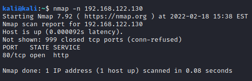
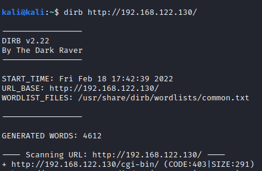
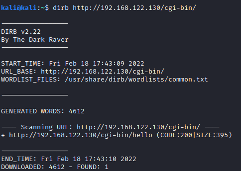
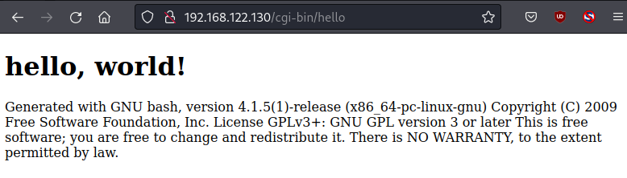
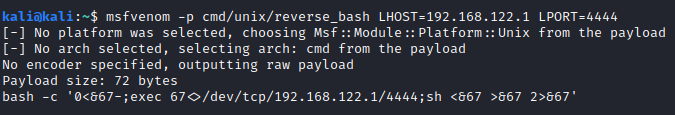
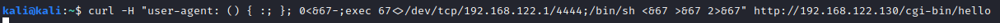
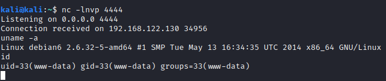

# Exploiting Shellshock

Shellshock is a vulnerability found in bash that affected versions of bash up until version 4.3.
In 2014, Stephane Chazelas discovered bash would evaluate commands after a function definition inside of environment variables.

I've set up a host to demonstrate this vulnerability by way of Apache's Mod_CGI.

An initial scan of the host show's port 80 listening.

Of course, versioning of Apache might hint at the vulnerability, but the vulnerability is in bash, not Apache.
Using dirb on the host shows a directory, /cgi-bin, we might find interesting.

Eventually, dirb looks at subdirectories, but runing it against /cgi-bin shows us a CGI script "hello".

Visiting this URL shows the output of a hello world program and that it was generated with a version of bash that's vulnerable to shellshock.

The reason we're able to exploit bash CGI scripts in this manner is because Apache's Mod_CGI calls the script with environment variables we've passed in the form of our user agent.

First thing's first, we need to generate a reverse shell. Let's do so using msfvenom.

Now we can start our netcat listener with "nc -lnvp 4444" and craft our exploit using curl.

After running that, we catch our reverse shell and do whatever it is we do.

